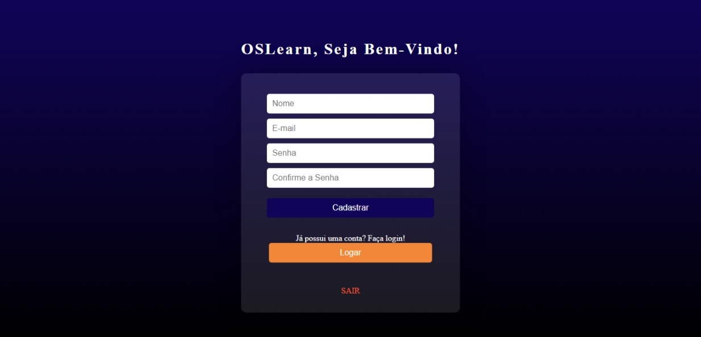
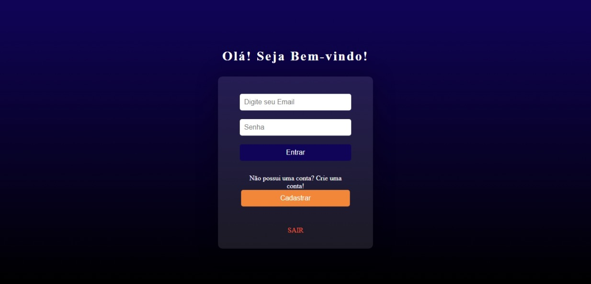
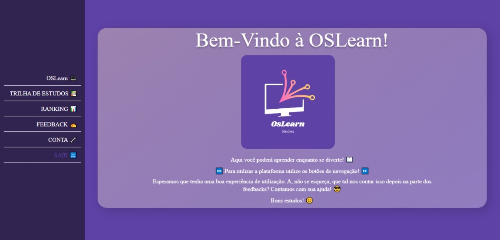
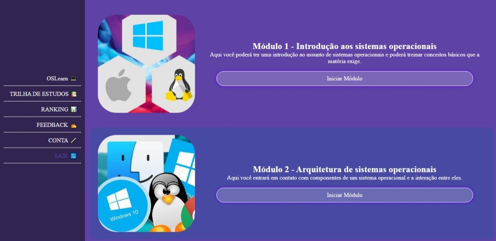
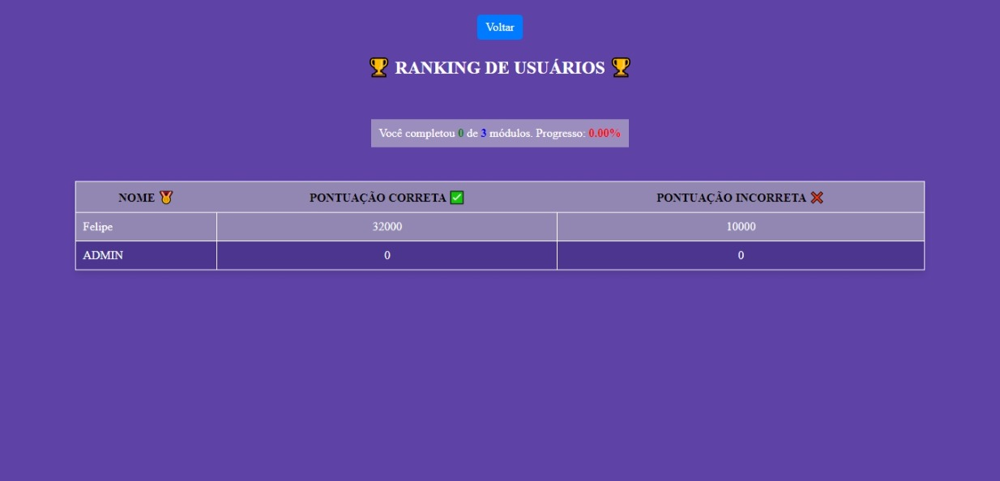
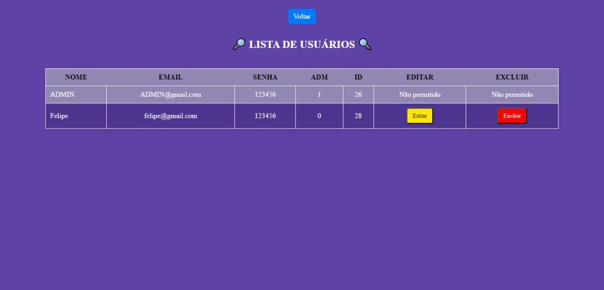
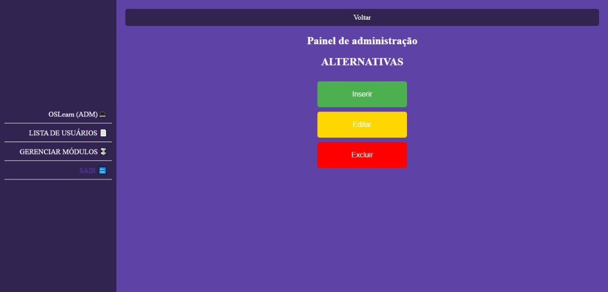
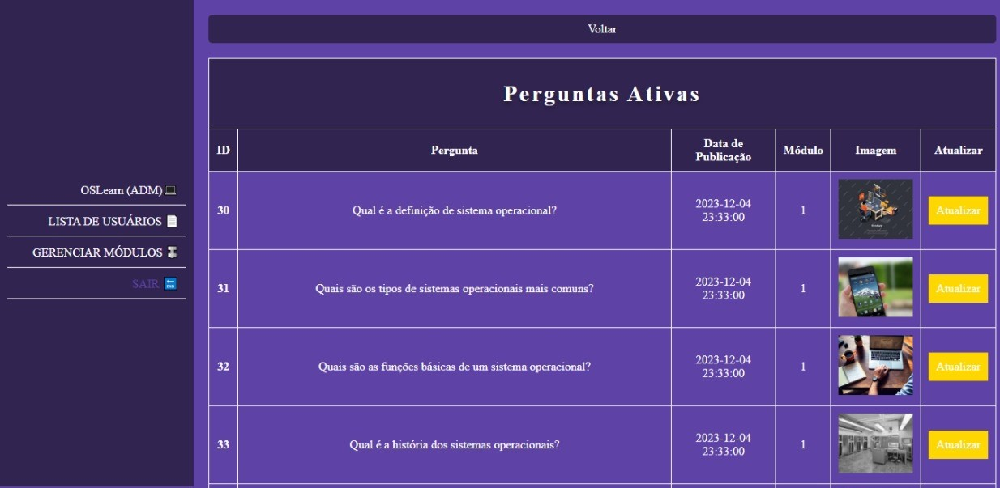
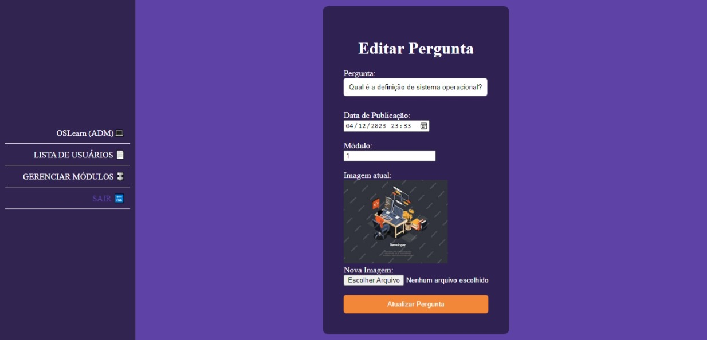

# OSLearn

# Sistema de Aprendizado - OSLearn 💻

O OSLearn é um sistema de aprendizado online que permite aos usuários realizar trilhas de estudos, respondendo a perguntas e acumulando pontos ao longo do percurso. Este projeto visa proporcionar uma experiência educacional interativa e envolvente.

## Integrantes do Grupo

- Felipe Gutierre
- Gustavo Souza Macedo

## Screenshots usuários

Screenshots do sistema com a visão do usuário em funcionamento.

## Screenshots administrador

Screenshots do sistema com a visão do administrador em funcionamento.

## Como executar

- Peça o banco de dados para os desenvolvedores;
- Clone o repositório;
- Abra o Xampp ligue o Apache e o MySQL;
- Abra o navegador e procure pela pasta oslearn;
- Parabéns, você está apto para utilizar o sistema;
- Desejamos uma boa navegação! :) 

## Tecnologias Utilizadas

- PHP
- MySQL
- HTML5
- CSS3
- JavaScript

## Autoria

- Desenvolvido por [Felipe Gutierre](https://github.com/FelipeGtr01) durante o curso de Análise e Desenvolvimento de Sistemas (ADS).
- Desenvolvido por [Gustavo Souza Macedo](https://github.com/GustavoMcd09) durante o curso de Análise e Desenvolvimento de Sistemas (ADS).
- Ano de desenvolvimento 2023.

## Licença

Este projeto está licenciado sob a Licença MIT. 

Copyright (c) <2023> <copyright Felipe Gutierre & Gustavo Souza Macedo>